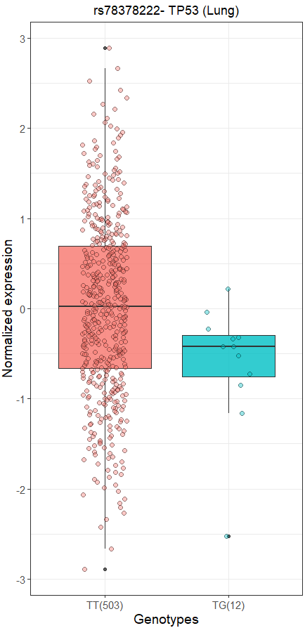
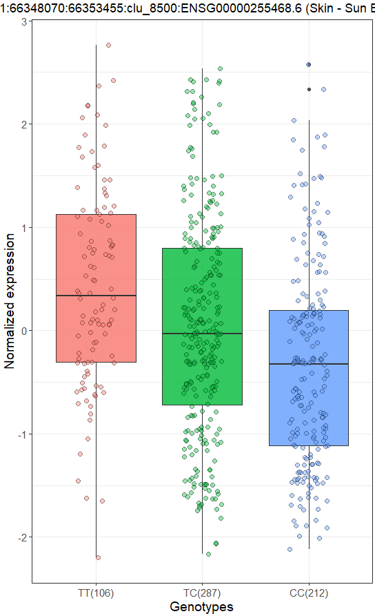
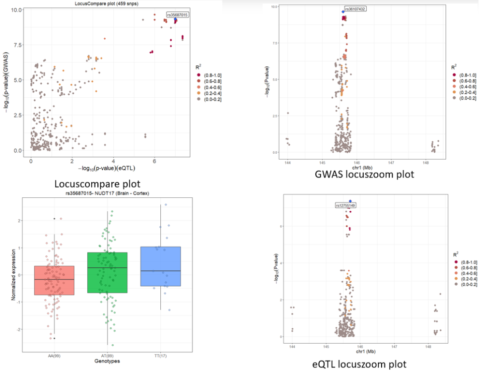

## xQTLbiolinks: a R package aims to query, download, visual and integrate integrative analysis of xQTL data

- By retrieving GTEx public-access data programmatically using the application programming interface (API) of [GTEx](https://gtexportal.org/home/api-docs) and [eQTL Catalogue](https://www.ebi.ac.uk/eqtl/api-docs/), the functions provided in this package enable users to access **molecular QTLs** (eQTLs and sQTLs) and **gene expressions** data filtered by tissue, gene, variant or dataset. 
- xQTLbiolinks consists of functions that can be grouped into four main levels: **Query**, **Download**, **Analyze** and **Visualize**.


<br/>

### xQTLbiolinks assist in:

1. to fast query variants’ effect on gene expression in the process of disease studies.
2. to perform data visualization (e.g. correlation plots of expression, boxplots of eQTL expression; and locuszom plots).
3. to detect disease associated genes by conduct colocalization analyses of GWAS and eQTL signals.
4. to uncover tissue-specific expressed genes.

### Citation
Ruofan Ding, Xudong Zou, Gao Wang, Lei Li. xQTLbiolinks: an R/Bioconductor package for integrative analysis of xQTL data. (submitted)
Institute of Systems and Physical Biology, Shenzhen Bay Laboratory, Shenzhen 518055, China

***

### Installation

```r
if(!require("remotes")){install.packages("remotes")}
remotes::install_git("https://gitee.com/stronghoney/xQTLbiolinks.git")
remotes::install_github("dingruofan/xQTLbiolinks")
```

### Examples

> Visualilzation of eQTL, sQTL, gene expression across tissues.

```r
xQTLvisual_eqtl("KIF15")
```

<p align="center">

</p>

```r
 genes <- c("FNDC8", "S100Z", "AQP6", "AMOT", "C3orf38", "FOXL1", "COX11", "FCN3", "DDX58", "CFI", "MS4A18", "NUDT13", "HOXA4", "VSX1")
 xQTLvisual_genesExp(genes, tissueSiteDetail="Lung")
```

<br/>
<p align="center">

</p>

<br/>

```r
geneExpTissues <- xQTLvisual_geneExpTissues("TP53",toTissueSite=TRUE)
```

<br/>
<p align="center">

</p>

<br/>

```r
expEqtl <- xQTLvisual_eqtlExp(variantName="rs78378222", gene ="TP53",
                              tissueSiteDetail="Lung")
```

<br/>
<p align="center">

</p>

```r
expSqtl <- xQTLvisual_sqtlExp(variantName="chr11_66561248_T_C_b38",variantType="variantId",
                              phenotypeId ="chr11:66348070:66353455:clu_8500:ENSG00000255468.6",
                              tissueSiteDetail="Skin - Sun Exposed (Lower leg)")
```
<p align="center">

</p>

> **An example of coloclization analysis.**

1. Load GWAS summary data (GRCH37) and :
   ```r
   gwasFile <- tempfile(pattern = "file")
   gwasURL <- "https://raw.githubusercontent.com/dingruofan/exampleData/master/gwas/AD/GLGC_AD_chr1_6_Sub3.txt"
   utils::download.file(gwasURL, destfile=gwasFile)
   gwasDF <- data.table::fread(gwasFile, sep="\t")
   gwasDF <- gwasDF[, .(rsid, chr, position, P, maf)]
   ```

2. Get sentinel snps from a GWAS dataset, and convert to GRCH38.
   ```r
   sentinelSnpDF <- xQTLanalyze_getSentinelSnp(gwasDF, centerRange=1e4, 
                                               genomeVersion="grch37", grch37To38=TRUE)
   ```

3. Identify trait genes with sentinel SNPs.
   ```r
   traitsAll <- xQTLanalyze_getTraits(sentinelSnpDF, detectRange=1e4)
   ```

4. Conduct colocalization analysis with trait gene of interest.
   ```r
   traitGene = "NUDT17"
   colocResult <- GTExanalyze_coloc(gwasDF, traitGene, geneType="geneSymbol", 
                                    genomeVersion="grch38", tissueSiteDetail="Brain - Cortex")
   ```

5. Visualization with locuszoom and locuscompare plot.
   ```r
   GTExvisual_locusZoom( colocResult$gwasEqtlInfo[,c("rsid","chr","position","pValue.eqtl")])
   GTExvisual_locusZoom( colocResult$gwasEqtlInfo[,c("rsid","chr","position","pValue.gwas")])
   GTExvisual_locusCompare( colocResult$gwasEqtlInfo[,c("rsid","pValue.eqtl")], colocResult$gwasEqtlInfo[,c("rsid","pValue.gwas")] )
   GTExvisual_eqtlExp(variantName="rs35687015", gene ="NUDT17", tissueSiteDetail="Brain - Cortex")
   ```
   <p align="center">
   
   </p>

<br/>

<br/>

### Documentations

To view documentation for each function, type `?functin name` in the R console, like: `?xQTLquery_gene`.

xQTLbiolinks current export the following functions:

1. #### Query:
   - **`xQTLquery_gene`**: query basic information (including gene name, symbol, position and description, etc ) of genes.
   - **`xQTLquery_geneAll`**: fetch basic information of all genes.
   - **`xQTLquery_varId`**: query variant with variant ID or SNP ID.
   - **`xQTLquery_varPos`**: query varints with genome postion.
   - **`xQTLquery_sample`**: query sample's details with a specifc tissue name or sample ID.
   - **`xQTLquery_tissue`**: Fetch all detail information of a specified tissue or all tissues.

2. #### Download
   - **`xQTLdownload_eqtl`**: download significant or unsignificant eQTL data of a tissue or across all tissues.
   - **`xQTLdownload_eqtlSig`**: download significant eQTL associations of a tissue or across all tissues.
   - **`xQTLdownload_eqtlExp`**: download normalized expression of gene for a eQTL pair.
   - **`xQTLdownload_eqtlAllAsso`**: download all tested variant-gene associations.
   - **`xQTLdownload_egene`**: download eGenes (eQTL Genes).
   - **`xQTLdownload_sqtlSig`**: download significant sQTL associations of a tissue or across all tissues.
   - **`xQTLdownload_sqtlExp`**: download normalized expression of intron for a sQTL pair.
   - **`xQTLdownload_sgene`**: download sGenes (sQTL Genes).
   - **`xQTLdownload_exp`**: download normalized gene expression at the sample level in a specified tissue.
   - **`xQTLdownload_geneMedExp`**: download genes' median expression in a tissue or across all tissues.
   - **`xQTLdownload_ld`**: download linkage disequilibrium data of the variants associated with this gene.

3. #### Ananlysis
   - **`xQTLanalyze_getSentinelSnp`**: detect sentinel SNPs in a given GWAS dataset.
   - **`xQTLanalyze_getTraits`**: identify trait genes with sentinel SNPs:
   - **`xQTLanalyze_coloc`**: conduct colocalization analysis with detected gene.
   - **`xQTLanalyze_TSExp`**: perform tissue-specific expression analysis.

4. #### Visulization
   - **`xQTLvisual_eqtl`**: plot significance of all eQTL associations for a gene across tissues.
   - **`xQTLvisual_eqtlExp`**: plot normalized expression among genotypes for eQTL.
   - **`xQTLvisual_sqtlExp`**: plot normalized expression among genotypes for sQTL.
   - **`xQTLvisual_geneCorr`**: The correlation plot of two genes’ expression.
   - **`xQTLvisual_genesExp`**: density plot of specified genes' expression profiles in a specified tissue.
   - **`xQTLvisual_geneExpTissues`**: plot distribution of the gene expression among multiple tissues.
   - **`xQTLvisual_locusZoom`**: plot locuszoom for showing regional information of the association signal relative to genomic position
   - **`xQTLvisual_locusCompare`**: visualize the colocalization of association summary statistics.
     
     
