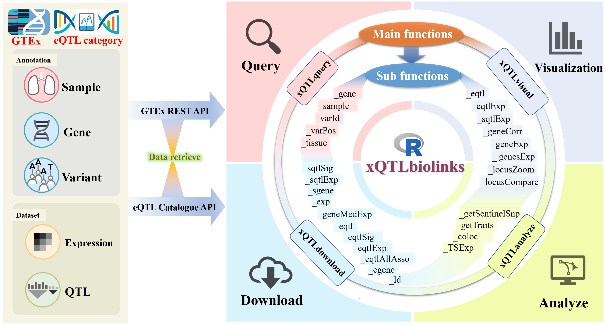

## xQTLbiolinks: a R package aims to query, download, visual and perform integrative analyses of xQTL data

- **`xQTLbiolinks`** is an R package that enable users to access **molecular QTLs** (eQTLs and sQTLs) and **gene expressions** data filtered by tissue, gene, variant or dataset, by retrieving GTEx public-access data programmatically using the application programming interface (API) of [GTEx](https://gtexportal.org/home/api-docs) and [eQTL Catalogue](https://www.ebi.ac.uk/eqtl/api-docs/).
- xQTLbiolinks consists of functions that can be grouped into four main levels: **Query**, **Download**, **Analyze** and **Visualize**.

<br/>

### Quick Start

1. Install xQTLbiolinks from Github: `remotes::install_github("dingruofan/xQTLbiolinks")`. For more detailed setup instructions, see below.
2. See the [**Manual**](https://github.com/dingruofan/xQTLbiolinks/wiki/Colocalization-analysis-with-xQTLbiolinks) for a quick application of colocalization analysis with xQTLbiolinks .
3. Then walk through these vignettes to learn more about xQTLbiolinks: [tissue-specific expression analysis](https://github.com/dingruofan/xQTLbiolinks/wiki/Tissue-specific-expression-analysis) and [visualization of expression and xQTL](https://github.com/dingruofan/xQTLbiolinks/wiki/Visualization-of-expression-and-xQTL).

### Citation
Ruofan Ding, Xudong Zou, Gao Wang, Lei Li. xQTLbiolinks: an R/Bioconductor package for integrative analysis of xQTL data. (submitted)

>Institute of Systems and Physical Biology, Shenzhen Bay Laboratory, Shenzhen 518055, China

***

### Setup

Package `SummarizedExperiment` is required but reposited in Biocouductor, instead of CRAN. So we first install `SummarizedExperiment` from Biocouductor, then install xQTLbiolinks from Github.

```r
# install required bioconductor package SummarizedExperiment:
if (!require("BiocManager")){install.packages("BiocManager")}
BiocManager::install("SummarizedExperiment")

# This command should automatically install any missing dependencies that are available from CRAN and GitHub.
if(!require("remotes")){install.packages("remotes")}
remotes::install_github("dingruofan/xQTLbiolinks")
```

### Documentations

To view documentation for each function, type `?functin name` in the R console, like: `?xQTLquery_gene`.

xQTLbiolinks current export the following functions:

1. #### Query:
   - **`xQTLquery_gene`**: query basic information (including gene name, symbol, position and description, etc ) of genes.
   - **`xQTLquery_geneAll`**: fetch basic information of all genes.
   - **`xQTLquery_varId`**: query variant with variant ID or SNP ID.
   - **`xQTLquery_varPos`**: query varints with genome postion.
   - **`xQTLquery_sampleByTissue`**: query sample's details with a tissue name.
   - **`xQTLquery_sampleByTissue`**: query sample's details with samples' IDs.
   - **`xQTLquery_tissue`**: Fetch all detail information of a specified tissue or all tissues.
   
2. #### Download
   - **`xQTLdownload_eqtl`**: download significant or unsignificant eQTL data of a tissue or across all tissues.
   - **`xQTLdownload_eqtlSig`**: download significant eQTL associations of a tissue or across all tissues.
   - **`xQTLdownload_eqtlExp`**: download normalized expression of gene for a eQTL pair.
   - **`xQTLdownload_eqtlAllAsso`**: download all tested variant-gene associations.
   - **`xQTLdownload_egene`**: download eGenes (eQTL Genes).
   - **`xQTLdownload_sqtlSig`**: download significant sQTL associations of a tissue or across all tissues.
   - **`xQTLdownload_sqtlExp`**: download normalized expression of intron for a sQTL pair.
   - **`xQTLdownload_sgene`**: download sGenes (sQTL Genes).
   - **`xQTLdownload_exp`**: download normalized gene expression at the sample level in a specified tissue.
   - **`xQTLdownload_geneMedExp`**: download genes' median expression in a tissue or across all tissues.
   - **`xQTLdownload_ld`**: download linkage disequilibrium data of the variants associated with this gene.

3. #### Ananlysis
   - **`xQTLanalyze_getSentinelSnp`**: detect sentinel SNPs in a given GWAS dataset.
   - **`xQTLanalyze_getTraits`**: identify trait genes with sentinel SNPs:
   - **`xQTLanalyze_coloc`**: conduct colocalization analysis with detected gene.
   - **`xQTLanalyze_TSExp`**: perform tissue-specific expression analysis.

4. #### Visulization
   - **`xQTLvisual_eqtl`**: plot significance of all eQTL associations for a gene across tissues.
   - **`xQTLvisual_eqtlExp`**: plot normalized expression among genotypes for eQTL.
   - **`xQTLvisual_sqtlExp`**: plot normalized expression among genotypes for sQTL.
   - **`xQTLvisual_geneCorr`**: The correlation plot of two genes’ expression.
   - **`xQTLvisual_genesExp`**: density plot of specified genes' expression profiles in a specified tissue.
   - **`xQTLvisual_geneExpTissues`**: plot distribution of the gene expression among multiple tissues.
   - **`xQTLvisual_locusZoom`**: plot locuszoom for showing regional information of the association signal relative to genomic position
   - **`xQTLvisual_locusCompare`**: visualize the colocalization of association summary statistics.
     
     
