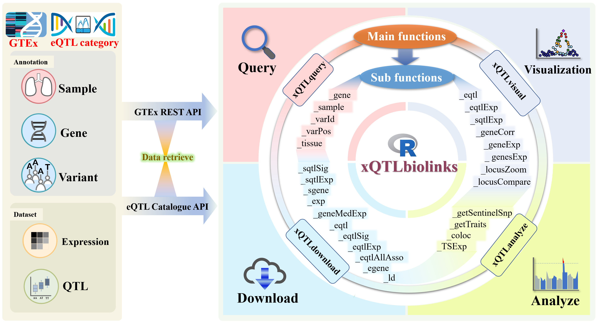
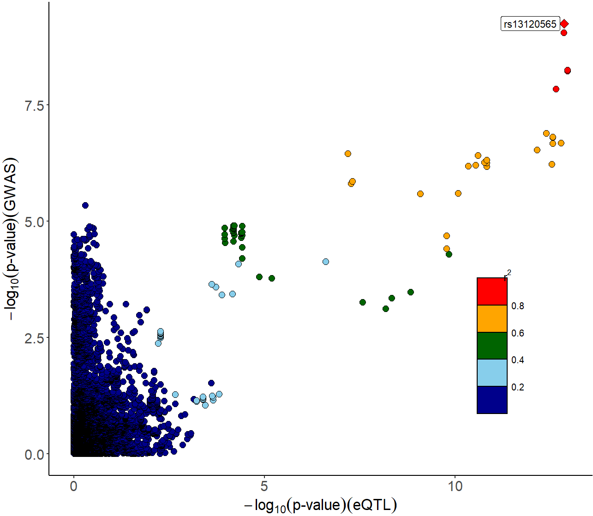
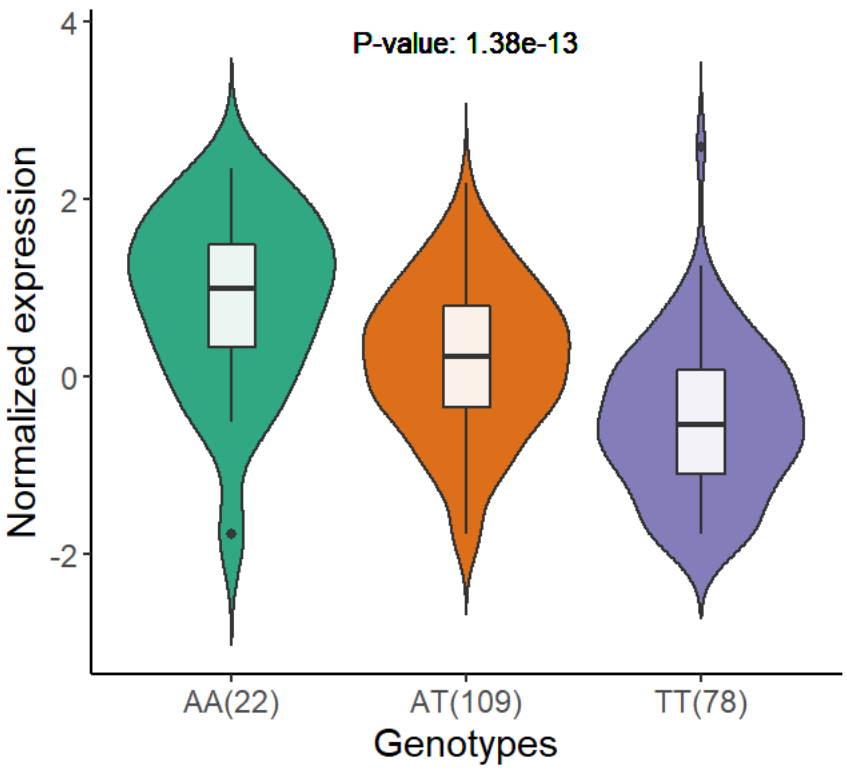

## xQTLbiolinks: a R package aims to query, download, visual and perform integrative analyses of xQTL data

- By retrieving GTEx public-access data programmatically using the application programming interface (API) of [GTEx](https://gtexportal.org/home/api-docs) and [eQTL Catalogue](https://www.ebi.ac.uk/eqtl/api-docs/), the functions provided in this package enable users to access **molecular QTLs** (eQTLs and sQTLs) and **gene expressions** data filtered by tissue, gene, variant or dataset. 
- xQTLbiolinks consists of functions that can be grouped into four main levels: **Query**, **Download**, **Analyze** and **Visualize**.

<br/>

### xQTLbiolinks assist in:

1. Fast query/download xQTLs and gene expression/splicing across 54 distinct cell types and tissues
2. Visualization of xQTL and gene expression across tissues(e.g. ridgeline plots of gene expression, boxplots of xQTL expression; and locuszoom plots of xQTLs).
3. Identify trait associated genes by perform colocalization analyses of GWAS and xQTL signals.
4. Identify co-expressed and tissue-specific expressed genes.

### Citation
Ruofan Ding, Xudong Zou, Gao Wang, Lei Li. xQTLbiolinks: an R/Bioconductor package for integrative analysis of xQTL data. (submitted)

>Institute of Systems and Physical Biology, Shenzhen Bay Laboratory, Shenzhen 518055, China

***

### Installation

```r
if(!require("remotes")){install.packages("remotes")}
# install required bioconductor packages:
if (!requireNamespace("BiocManager", quietly = TRUE))
    install.packages("BiocManager")
bio_pkgs=c("SummarizedExperiment", "IRanges", "GenomicRanges", "GenomeInfoDb", "BiocGenerics")
BiocManager::install(bio_pkgs)
# install xQTLbiolinks:
remotes::install_github("dingruofan/xQTLbiolinks")
```

### Examples

> Visualilzation of eQTL, sQTL, gene expression across tissues.

```r
xQTLvisual_eqtl("KIF15")
```

<p align="center">

</p>

```r
 genes <- c("FNDC8", "S100Z", "AQP6", "AMOT", "C3orf38", "FOXL1", "COX11", "FCN3", "DDX58", "CFI", "MS4A18", "NUDT13", "HOXA4", "VSX1")
 xQTLvisual_genesExp(genes, tissueSiteDetail="Lung")
```

<br/>
<p align="center">

</p>

<br/>

```r
geneExpTissues <- xQTLvisual_geneExpTissues("TP53",toTissueSite=TRUE)
```

<br/>
<p align="center">

</p>

<br/>

```r
expEqtl <- xQTLvisual_eqtlExp(variantName="rs78378222", gene ="TP53",
                              tissueSiteDetail="Lung")
```

<br/>
<p align="center">

</p>

```r
expSqtl <- xQTLvisual_sqtlExp(variantName="chr11_66561248_T_C_b38",variantType="variantId",
                              phenotypeId ="chr11:66348070:66353455:clu_8500:ENSG00000255468.6",
                              tissueSiteDetail="Skin - Sun Exposed (Lower leg)")
```
<p align="center">

</p>

> **An example of coloclization analysis.**

1. Download and load a summary statistics dataset (GRCH38) from GWAS Catalog:

   ```r
   # http://ftp.ebi.ac.uk/pub/databases/gwas/summary_statistics/GCST006001-GCST007000/GCST006572/harmonised/30038396-GCST006572-EFO_0008354.h.tsv.gz
   gwasDF <- fread("D:\\OneDrive\\PC\\PostDoc\\xQTLbiolinks\\30038396-GCST006572-EFO_0008354.h.tsv.gz")
   # extract columns.
   gwasDF<- gwasDF[,.(rsid = hm_rsid, chr=hm_chrom, position=hm_pos, P=p_value, maf=hm_effect_allele_frequency)]
   gwasDF <- na.omit(gwasDF)
   ```

2. Filter sentinel snps, and convert to GRCH38 if its genome version is GRCH37:
   ```r
   sentinelSnpDF <- xQTLanalyze_getSentinelSnp(gwasDF, 
                                               centerRange=1e4,
                                               genomeVersion="grch38")
   ```

3. Identify trait genes for each sentinel SNPs:

   ```r
   traitsAll <- xQTLanalyze_getTraits(sentinelSnpDF, detectRange=1e4)
   ```
   Totally, [2615] associations between [1103] traits genes and [1617] SNPs are detected
   
4. Download eGenes for the tissue of interest, then get the overlap of eGenes and trait genes to reduce the number of trait genes:

   ```r
   tissueSiteDetail <- "Brain - Cerebellum"
   egeneDF <- xQTLdownload_egene(tissueSiteDetail = tissueSiteDetail) #11240
   ```

   Get the overlap of eGenes and trait genes.
   ```r
   traitsAll <- traitsAll[gencodeId %in% egeneDF$gencodeId] 
   ```
   In total of 341 trait gene left.
   
   
5. Following three steps of colocalization analysis are encapsulated in one function `xQTLanalyze_coloc`:
   - Retrieved all associations from EBI eQTL catalogue for a specified gene.
   - Merge the data.frame of GWAS and eQTL by rsid.
   - Perform colocalization analysis using coloc package.

   
   Conduct colocalization analysis for each trait gene with this function using a for loop:
   ```r
   colocResultAll <- data.table()
   traitGenes <- unique(traitsAll$geneSymbol)
    for(i in 1:length(traitGenes)){
      colocResult <- xQTLanalyze_coloc(gwasDF, traitGenes[i], tissueSiteDetail=tissueSiteDetail)
      colocResult <- colocResult$coloc_Out_summary
      colocResult$gene <-traitGenes[i]
      colocResultAll <- rbind(colocResultAll, colocResult)
      message(format(Sys.time(), "== %Y-%b-%d %H:%M:%S ")," == Id:",i, "== Gene:",traitGenes[i], " == PP4: ", colocResult$PP.H4.abf)
     }
   ```

6. Visualization of the results. For the potential casual gene (RPS26, PP4=0.998) with the largest value of PP4:

   >prepare data:
   
   ```r
   eqtlAsso <- xQTLdownload_eqtlAllAsso("RPS26", tissueSiteDetail = tissueSiteDetail, withB37VariantId=FALSE)
   gwasDF <- gwasDF[,.(rsid, chrom=paste0("chr",chr), maf, pValue=P, position)]
   eqtlAsso <- eqtlAsso[,.(rsid=snpId, maf, pValue, position=as.numeric(pos))]
   gwasEqtldata <- merge(gwasDF,eqtlAsso,by=c("rsid", "position"), suffixes = c(".gwas",".eqtl"))
   ```
   
   >P-value distribution and comparison of the signals of GWAS and eQTL:
   
   ```r
   p1 <- xQTLvisual_locusCompare( gwasEqtldata[,.(rsid, pValue.eqtl)], 
                                  gwasEqtldata[,.(rsid, pValue.gwas)] )
   ```
   <p align="center">
   
   </p>
   
   >Locuszoom plot of eQTL signals:
   
   ```r
   p_eqtl <- xQTLvisual_locusZoom( gwasEqtldata[,.(rsid, chrom, pos=position, pValue.eqtl)])
   ```
   <p align="center">
   
   </p>
   
   >Locuszoom plot of GWAS signals:
   
   ```r
   p_gwas <- xQTLvisual_locusZoom( gwasEqtldata[,.(rsid, chrom, pos=position, pValue.gwas)])
   ```
   <p align="center">
   
   </p>
   
   >Violin plot of normalized exprssion of eQTL:
   
   ```r
   p_eqtlExp <- xQTLvisual_eqtlExp("rs1131017", "RPS26", tissueSiteDetail = tissueSiteDetail)
   ```
   <p align="center">
   
   </p>
   
   


<br/>

<br/>

### Documentations

To view documentation for each function, type `?functin name` in the R console, like: `?xQTLquery_gene`.

xQTLbiolinks current export the following functions:

1. #### Query:
   - **`xQTLquery_gene`**: query basic information (including gene name, symbol, position and description, etc ) of genes.
   - **`xQTLquery_geneAll`**: fetch basic information of all genes.
   - **`xQTLquery_varId`**: query variant with variant ID or SNP ID.
   - **`xQTLquery_varPos`**: query varints with genome postion.
   - **`xQTLquery_sample`**: query sample's details with a specifc tissue name or sample ID.
   - **`xQTLquery_tissue`**: Fetch all detail information of a specified tissue or all tissues.

2. #### Download
   - **`xQTLdownload_eqtl`**: download significant or unsignificant eQTL data of a tissue or across all tissues.
   - **`xQTLdownload_eqtlSig`**: download significant eQTL associations of a tissue or across all tissues.
   - **`xQTLdownload_eqtlExp`**: download normalized expression of gene for a eQTL pair.
   - **`xQTLdownload_eqtlAllAsso`**: download all tested variant-gene associations.
   - **`xQTLdownload_egene`**: download eGenes (eQTL Genes).
   - **`xQTLdownload_sqtlSig`**: download significant sQTL associations of a tissue or across all tissues.
   - **`xQTLdownload_sqtlExp`**: download normalized expression of intron for a sQTL pair.
   - **`xQTLdownload_sgene`**: download sGenes (sQTL Genes).
   - **`xQTLdownload_exp`**: download normalized gene expression at the sample level in a specified tissue.
   - **`xQTLdownload_geneMedExp`**: download genes' median expression in a tissue or across all tissues.
   - **`xQTLdownload_ld`**: download linkage disequilibrium data of the variants associated with this gene.

3. #### Ananlysis
   - **`xQTLanalyze_getSentinelSnp`**: detect sentinel SNPs in a given GWAS dataset.
   - **`xQTLanalyze_getTraits`**: identify trait genes with sentinel SNPs:
   - **`xQTLanalyze_coloc`**: conduct colocalization analysis with detected gene.
   - **`xQTLanalyze_TSExp`**: perform tissue-specific expression analysis.

4. #### Visulization
   - **`xQTLvisual_eqtl`**: plot significance of all eQTL associations for a gene across tissues.
   - **`xQTLvisual_eqtlExp`**: plot normalized expression among genotypes for eQTL.
   - **`xQTLvisual_sqtlExp`**: plot normalized expression among genotypes for sQTL.
   - **`xQTLvisual_geneCorr`**: The correlation plot of two genes’ expression.
   - **`xQTLvisual_genesExp`**: density plot of specified genes' expression profiles in a specified tissue.
   - **`xQTLvisual_geneExpTissues`**: plot distribution of the gene expression among multiple tissues.
   - **`xQTLvisual_locusZoom`**: plot locuszoom for showing regional information of the association signal relative to genomic position
   - **`xQTLvisual_locusCompare`**: visualize the colocalization of association summary statistics.
     
     
