```{r, include = FALSE}
knitr::opts_chunk$set(
  echo=TRUE,
  progress =FALSE,
  comment = "#>"
)
options(rmarkdown.html_vignette.check_title = FALSE)
```


## Before we start.

All we need to prepare include three parts:

1.  GWAS summary statistics dataset.
2.  Tissue of interest.
3.  Following three installed packages.

```{r, results = 'hide', echo=TRUE, message=FALSE, warning=FALSE, eval=TRUE}
library(xQTLbiolinks)
library(coloc)
library(hyprcoloc)
library(data.table)
library(stringr)
library(R.utils)
library(TxDb.Hsapiens.UCSC.hg38.knownGene)
library(VariantAnnotation)
```

Prostate cancer is one of the most common cancers in men. Prostate cancer pathogenesis involves both heritable and environmental factors. The molecular events involved in the development or progression of prostate cancer are still unclear. In this example, we aim to figure out the causal variants and genes assocaited with prostate cancer, and to uncover potential molecular mechanisms of regulation.

For data preparation, we download summary statistics dataset of a GWAS study ([GCST006085](http://ftp.ebi.ac.uk/pub/databases/gwas/summary_statistics/GCST006001-GCST007000/GCST006085/harmonised/29892016-GCST006085-EFO_0001663-build37.f.tsv.gz)) of prostate cancer from GWAS category and load the dataset in R with `data.table` package. Correspondingly, we chose tissue `Prostate` for study. We retain the variants with dbSNP id (start with `rs`), and a data.table object named `gwasDF` of 13,498,990 (rows) x 7 (cols) is loaded.


```{r, message=FALSE, warning=FALSE, include=FALSE}
t1 <- tempfile()
utils::download.file("http://bioinfo.szbl.ac.cn/xQTL_biolinks/xqtl_data/2023_1_21/prostate_coloc_2023_12_21.zip", t1)
load(unz(t1,"prostate_coloc_2023_12_21.RData"))
close(file(t1))
rm(t1)
```

```{r, results = 'hide', echo=TRUE, message=FALSE, warning=FALSE, eval=FALSE}
gwasDF <- fread("29892016-GCST006085-EFO_0001663-build37.f.tsv.gz")
# extract columns.
gwasDF<- gwasDF[str_detect(variant_id, "^rs"),.(rsid=variant_id, chrom=chromosome, position= base_pair_location, pValue=p_value, AF=effect_allele_frequency, beta, se= standard_error)]
# tissue:
tissueSiteDetail="Prostate"
```

```{r, message=FALSE, warning=FALSE, include=FALSE}
gwasDF <- example_Coloc_gwasDF
```

```{r, eval=TRUE}
head(gwasDF)
```

Now we can perform quality control for this GWAS dataset by estimating the genomic inflation factor,  validating QQ-plot and PZ-plot using xQTLbiolinks.

```{r, results = 'hide', echo=TRUE, message=FALSE,  warning=FALSE, eval=FALSE}
xQTLvisual_qqPlot(gwasDF[,.(pValue)])
xQTLvisual_PZPlot(gwasDF[,.(pValue, beta, se)])
```

```{r, qq_pz.png, fig.align = 'center', out.width = "80%", echo=FALSE}
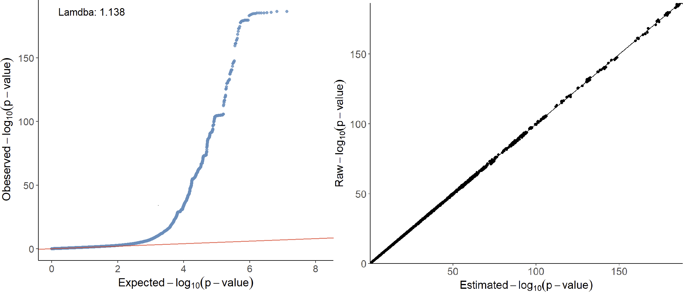
```

Left is the QQ-plot. The x-axis of the QQ-plot represents the expected p-values under the null hypothesis, while the y-axis represents the observed p-values from the GWAS summary statistics data. There is a significant deviation from the diagonal line, which indicates potential variations from the null hypothesis that may result from true associations or LD. 
The genomic inflation factor (lambda) is labeled in the top left of the QQ-plot, and a lambda value of 1.138 indicating no strong population stratification. 
Right is the PZ plot, the observed p-values on the y-axis and the corresponding p-values derived from z-scores that estimated by beta and se on the x-axis. A strong concordance can be observed between the observed p-values and those calculated from Z-scores.

Genomic annotation of the significant signals can be conducted using `xQTLanno_genomic`:
```{r, results = 'hide', echo=TRUE, message=FALSE, out.width = "70%", warning=FALSE, eval=FALSE, include=FALSE}
snpHits <- xQTLanno_genomic(gwasDF[,.(chrom=paste0("chr",chrom), position, pValue)])
xQTLvisual_anno(snpHits)
```
```{r, anno.png, fig.align = 'center', out.width = "35%", echo=FALSE, include=FALSE}
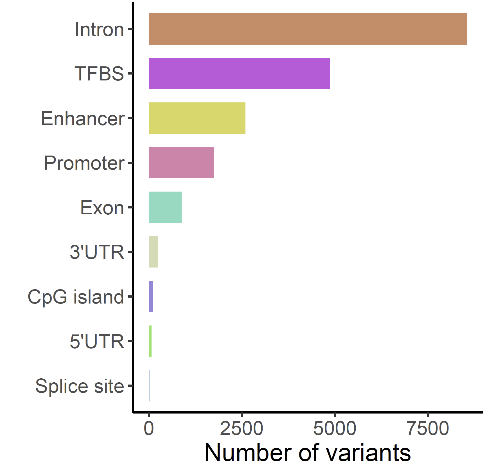
```


## Step 1: Identify sentinel SNPs:

Sentinel SNP is the most prominent signal within a given genome range, and is usually in high LD with causal variants. By default, xQTLbiolinks detect sentinel snps that with the p-value \< 5e-8 and SNP-to-SNP distance \> 10e6 bp. **Note**: For in this example, due to the inconsistent genome version between the GWAS dataset (GRCh37) and eQTL associations (GRCh38) from eQTL category, conversion of genome version is required, and can be conducted using `xQTLanalyze_getSentinelSnp` with `genomeVersion="grch37"` and `grch37To38=TRUE` (package `rtracklayer`is required):

```{r, results = 'hide', echo=TRUE, message=FALSE, warning=FALSE, eval=FALSE}
sentinelSnpDF <- xQTLanalyze_getSentinelSnp(gwasDF, centerRange=1e6,
                                            genomeVersion="grch37", grch37To38=TRUE)
```

```{r, message=FALSE, warning=FALSE, include=FALSE, echo=FALSE}
sentinelSnpDF <- example_Coloc_sentinelSNP
```

A total of 94 sentinel SNPs are detected.

```{r, eval=TRUE}
head(sentinelSnpDF)
```

## Step 2: Identify trait genes for each sentinel SNPs:

Trait genes are genes that located in the range of 1Mb (default, can be changed with parameter `detectRange`) of sentinel SNPs. In order to reduce the number of trait genes and thus reduce the running time, we take the overlap of eGenes and trait genes as the final output of the function `xQTLanalyze_getTraits`:

```{r, results = 'hide', echo=TRUE, message=FALSE, warning=FALSE, eval=FALSE}
traitsAll <- xQTLanalyze_getTraits(sentinelSnpDF, detectRange=1e6, tissueSiteDetail=tissueSiteDetail)
```

Totally, 898 associations between 835 traits genes and 92 sentinel SNPs are detected

```{r, message=FALSE, warning=FALSE, include=FALSE, eval=FALSE}
tissueSiteDetail="Prostate"
traitsAll <- example_Coloc_traitsAll
```


```{r, eval=TRUE}
head(traitsAll)
```

## Step 3: Conduct colocalization analysis with eQTL:

Following three steps of colocalization analysis are encapsulated in one function xQTLanalyze_coloc:

1.  Retrieved all associations from EBI eQTL catalogue for a specified gene.
2.  Merge the data.frame of GWAS and eQTL by rsid.
3.  Perform colocalization analysis using `coloc` and `hyprcoloc` methods.

For above 835 trait genes, a for loop can be used to get these genes' outputs of colocalization analysis (this may take several minutes):

```{r, results = 'hide', echo=TRUE, message=FALSE, warning=FALSE, eval=FALSE}
# All genes:
genesAll<- xQTLquery_gene(unique(traitsAll$gencodeId))
setindex(gwasDF, rsid) # speed up merging
# A data.table to save results:
colocResultAll <- data.table()
for(i in 1:nrow(genesAll)){
  # eQTL of the gene i
  eQTL_i <- xQTLdownload_eqtlAllAsso(genesAll[i]$gencodeId, geneType = "gencodeId", tissueLabel=tissueSiteDetail, withB37VariantId = FALSE, data_source="liLab")
  gwasDF_i <- gwasDF[rsid  %in% eQTL_i$rsid,]
  if(is.null(eQTL_i)){next()}; if(nrow(gwasDF_i)==0){next()}
  eQTL_i <- merge(eQTL_i, gwasDF_i[,.(rsid, chrom, position)], by ="rsid")[,.(rsid, chrom, position, pValue, maf, beta, se)]
  # using both method coloc and hyprcoloc to perform colocalization analysis
  colocResult_i <- xQTLanalyze_coloc_diy(gwasDF = gwasDF_i, qtlDF = eQTL_i, method="Both")
  # 
  if(!is.null(colocResult_i)){ 
      colocResult_i <- colocResult_i$coloc_Out_summary
      colocResult_i <- cbind(genesAll[i,c("geneSymbol","gencodeId")], colocResult_i)
      colocResultAll <- rbind(colocResultAll, colocResult_i)}
  message(" == Id: ",i,"/",nrow(genesAll)," == Gene:",genesAll[i]$gencodeId)
}
```

```{r, message=FALSE, warning=FALSE, include=FALSE, eval=FALSE}
colocResultAll <- example_Coloc_colocResultAll
```


In this case, we invoke two methods to conduct colocalization analysis, (1). `coloc` that estimates the posterior support of variants for each hypothesis: H0,H1,H2,H3,H4:

-   H0 : neither trait has a genetic association in the region
-   H1: only trait 1 has a genetic association in the region
-   H2: only trait 2 has a genetic association in the region
-   H3: both traits are associated, but with different causal variants
-   H4: both traits are associated and share a single causal variant

and (2). `hyprcoloc` that calculates the posterior probability that all traits share a causal variant.

Output is a data.table object that combined all results of `colocOut` of all genes. 

```{r, eval=TRUE}
head(colocResultAll)
```

We can see that the two methodologies' outcomes are quite consistent. With a threshold of 0.75 for `coloc` and 0.5 for `hyprcoloc`, a total of 26 colocalized genes are shared.

```{r, results = 'hide', echo=FALSE, message=FALSE, warning=FALSE, eval=FALSE, include=FALSE}
library(VennDiagram)
T <- venn.diagram( list(colocOut = colocResultAll[PP.H4.abf>=0.75]$geneSymbol, 
                   hyprcolocOut = colocResultAll[hypr_posterior>=0.5]$geneSymbol),
                   filename = NULL,lwd=1,lty=1, width = 8000, height = 10000,
                   fill=c('#ff7a45','#597ef7'), col=c('red','blue'), cat.col=c('red','blue'),
                   main.cex = 0.45, sub.cex= 0.1,
                   disable.logging = TRUE)
grid.draw(T)
```

```{r, venn_coloc_hyprcoloc, fig.align = 'center', out.width = "30%", echo=FALSE, include=FALSE}
knitr::include_graphics("images/prostate/venn_coloc_hyprcoloc.png", error = FALSE)
```


To save time and go through this case as soon as possible, you can get the above result directly with:

```{r, results = 'hide', echo=TRUE, message=FALSE, warning=FALSE, eval=FALSE}
colocResultAll <- fread("http://bioinfo.szbl.ac.cn/xQTL_biolinks/xqtl_data/colocResultAll.txt")
```

## Step 4: Visualization of the results:

We considered colocalization tests with a posterior probability of hypothesis 4 (PPH4.ABF) > 0.75 & hypr_posterior > 0.5 as having strong or moderate evidence for colocalization.


```{r, message=FALSE, warning=FALSE, include=FALSE, eval=FALSE}
colocResultsig <- fread("http://bioinfo.szbl.ac.cn/xQTL_biolinks/xqtl_data/example_Coloc_colocResultsig.txt")
```

```{r, results = 'hide', echo=TRUE, message=FALSE, warning=FALSE, eval=FALSE}
colocResultsig <- colocResultAll[PP.H4.abf>0.75 & hypr_posterior>0.5][order(-PP.H4.abf)]
```

There are 26 trait genes that are associated and share a single causal variant:

```{r, eval=TRUE}
head(colocResultsig)
```

All these genes' details can be fetched with `xQTLquery_gene`:

```{r eval=FALSE, message=FALSE}
outGenes <- xQTLquery_gene(colocResultsig$gencodeId)
```


Add the value of PPH4 for each gene, and remove non-protein-coding genes:

```{r, eval=FALSE}
outGenes <- merge(colocResultsig[,c("gencodeId", "PP.H4.abf", "candidate_snp", "SNP.PP.H4", "hypr_posterior")], 
                  outGenes[,c("geneSymbol", "gencodeId", "entrezGeneId", "geneType")], by="gencodeId", sort=FALSE)
outGenes <- outGenes[geneType =="protein coding"]
```

```{r, eval=TRUE}
outGenes
```

Ridgeline plot can be used to compare the expressions among these genes:

```{r, results = 'hide', echo=TRUE, message=FALSE, warning=FALSE, eval=FALSE}
xQTLvisual_genesExp(outGenes$geneSymbol, tissueSiteDetail=tissueSiteDetail)
```


```{r, prostate_geneExpInOneTissue.png, fig.align = 'center', out.width = "50%", echo=FALSE}
knitr::include_graphics("images/prostate/prostate_geneExpInOneTissue.png", error = FALSE)
```


Trait gene **`MMP7`** that with the highest `PPH4.ABF=0.9978` & `hypr_posterior=0.9993` encodes a member of the peptidase M10 family of matrix metalloproteinases, which is involved in the breakdown of extracellular matrix in normal physiological processes, such as embryonic development, reproduction, and tissue remodeling, as well as in disease processes, such as arthritis and metastasis. Prostate cancer can be promoted via MMP7-induced epithelial-to-mesenchymal transition by Interleukin-17. Resent literature has shown that serum MMP7 levels could guide metastatic therapy for prostate cancer.

Expression of MMP7 in multiple tissues can be plotted with `xQTLvisual_geneExpTissues`:

```{r, results = 'hide', echo=TRUE, message=FALSE, warning=FALSE, eval=FALSE}
geneExpTissues <- xQTLvisual_geneExpTissues("MMP7", log10y = TRUE)
```

```{r, prostate_exp_multissues.png, fig.align = 'center', out.width = "90%", echo=FALSE}
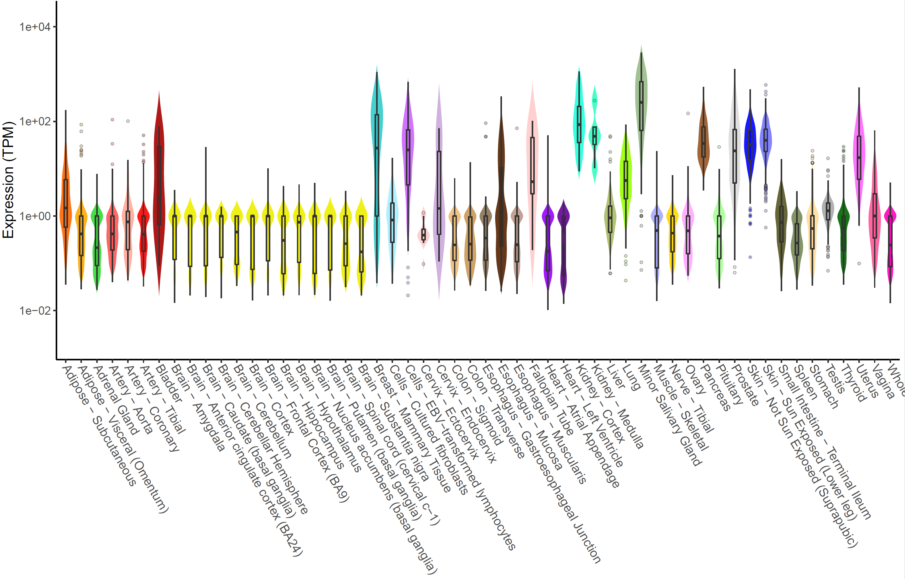
```

The number and significance of eQTLs in distinguished tissues are capable of showing a tissue-specific effect or a ubiquitous effect. The function `xQTLvisual_eqtl` can be used to indicate whether the gene is widely regulation in various tissues.

```{r, results = 'hide', echo=TRUE, message=FALSE, warning=FALSE, eval=FALSE}
xQTLvisual_eqtl("MMP7")
```

```{r, prostate_eqtlTissues.png, fig.align = 'center', out.width = "90%", echo=FALSE}
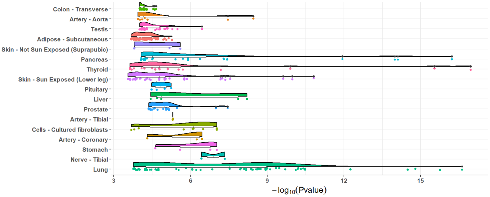
```

Besides, we provide functions `xQTLvisual_locusCompare` and `xQTLvisual_locusZoom` to visualize the colocalization between the GWAS and the eQTL dataset for a specified gene, we take the gene `MMP7` as an example:

```{r, message=FALSE, warning=FALSE, include=FALSE, eval=FALSE}
t1 <- tempfile()
utils::download.file("http://bioinfo.szbl.ac.cn/xQTL_biolinks/xqtl_data/gwasEqtldata.txt", t1)
gwasEqtldata <- data.table::fread(t1)
close(file(t1))
rm(t1)
```

```{r, results = 'hide', echo=TRUE, message=FALSE, warning=FALSE, eval=FALSE}
# Download all eQTL associations of gene  MMP7 in prostate:
eqtlAsso <- xQTLdownload_eqtlAllAsso(gene="MMP7",tissueLabel = tissueSiteDetail)
eqtlAsso <- data.table::as.data.table(eqtlAsso)
# Merge the variants of GWAS and eQTL dataset by rsid:
gwasEqtldata <- merge(gwasDF[,-c("AF")], eqtlAsso[,.(rsid=snpId, pValue)],
                      by=c("rsid"), suffixes = c(".gwas",".eqtl"))
```

Five retained fields are required:

```{r, eval=TRUE}
gwasEqtldata
```

Visualization of p-value distribution and comparison of the signals of GWAS and eQTL:

```{r, results = 'hide', echo=TRUE, message=FALSE, warning=FALSE, eval=FALSE}
xQTLvisual_locusCompare(gwasEqtldata[,.(rsid, pValue.eqtl)], 
                        gwasEqtldata[,.(rsid, pValue.gwas)], legend_position = "bottomright")
```

```{r, prostate_locuscompare.png, fig.align = 'center', out.width = "50%", echo=FALSE}
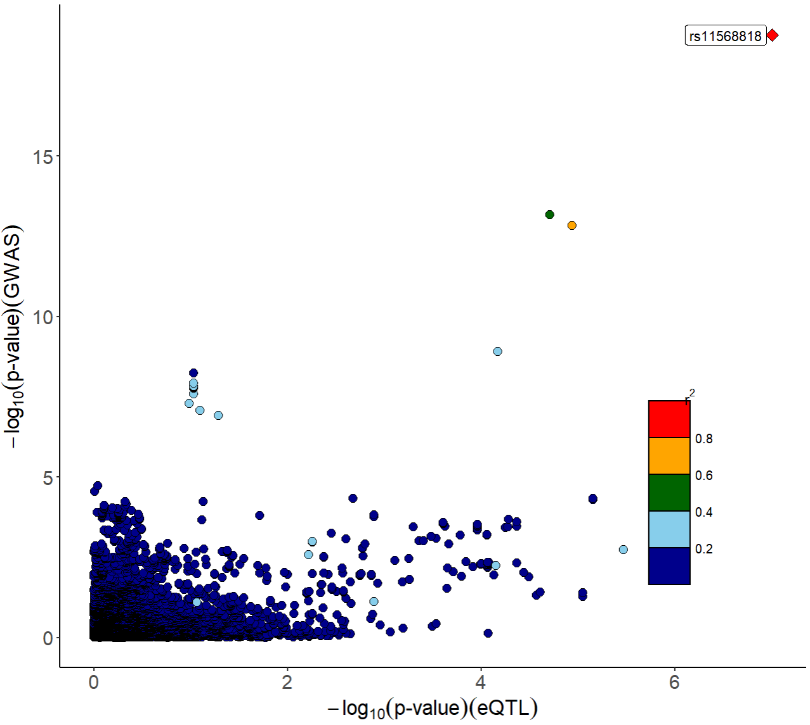
```

Locuszoom plot of GWAS signals:

```{r, results = 'hide', echo=TRUE, message=FALSE, warning=FALSE, eval=FALSE}
xQTLvisual_locusZoom(gwasEqtldata[,.(rsid, chrom, position, pValue.gwas)], legend=FALSE)
```

```{r, prostate_locuszoom_gwas.png, fig.align = 'center', out.width = "50%", echo=FALSE}
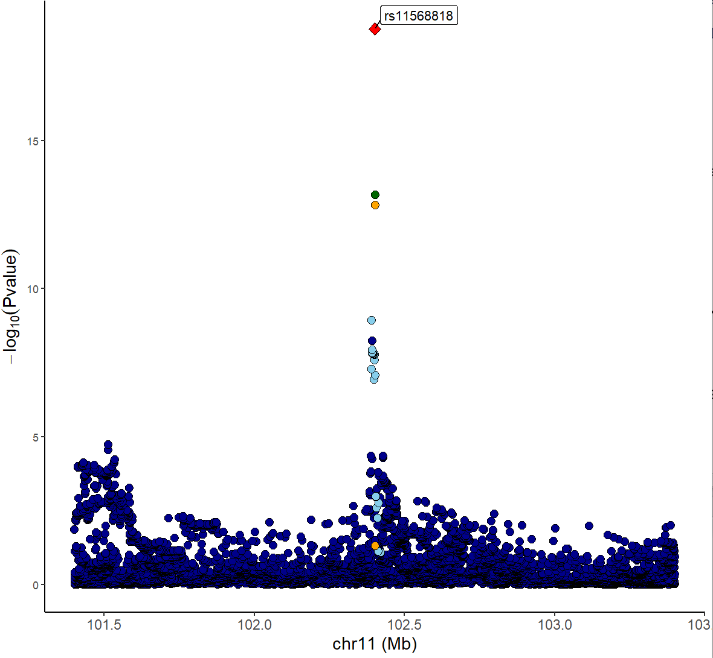
```

Locuszoom plot of eQTL signals:

```{r, results = 'hide', echo=TRUE, message=FALSE, warning=FALSE, eval=FALSE}
xQTLvisual_locusZoom(gwasEqtldata[,.(rsid, chrom, position, pValue.eqtl)], legend=FALSE)
```

```{r, prostate_locuszoom_eqtl.png, fig.align = 'center', out.width = "50%", echo=FALSE}
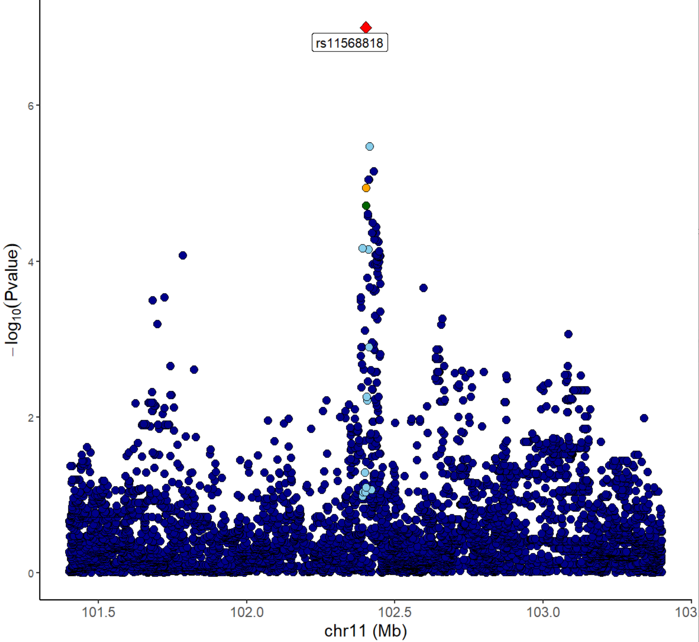
```

We can also combine locuscompare and locuszoom plot using function `xQTLvisual_locusCombine`:

```{r, results = 'hide', echo=TRUE, message=FALSE, warning=FALSE, eval=FALSE}
xQTLvisual_locusCombine(gwasEqtldata[,c("rsid","chrom", "position", "pValue.gwas", "pValue.eqtl")])
```

```{r, prostate_combined.png, fig.align = 'center', out.width = "90%", echo=FALSE}
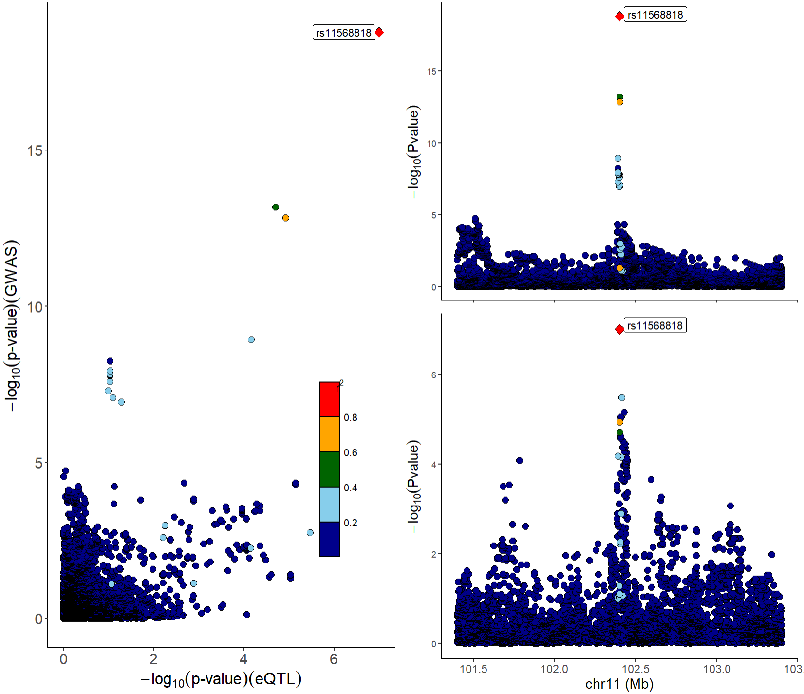
```

From the above figures, we can see that the SNP `rs11568818` is potential causal variant, and we can use a violin plot to show the normalized effect size of it:

```{r, results = 'hide', echo=TRUE, message=FALSE, warning=FALSE, eval=FALSE}
xQTLvisual_eqtlExp("rs11568818", "MMP7", tissueSiteDetail = tissueSiteDetail)
```

```{r, prostate_eQTL_exp.png, fig.align = 'center', out.width = "40%", echo=FALSE}
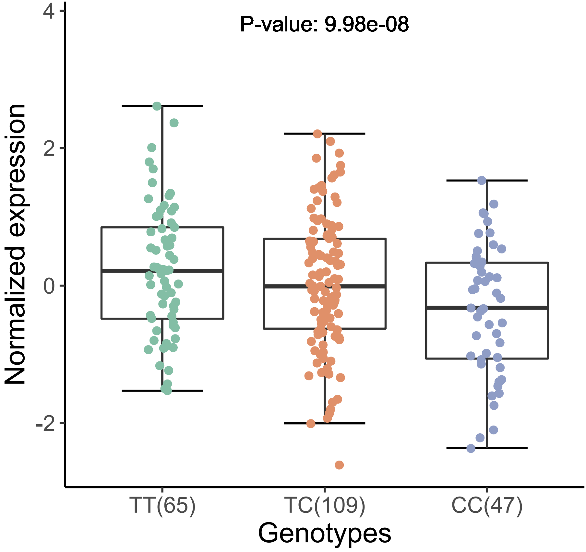
```

## Extension: Integrative analysis with external packages or tools

To gain insight into the function of trait genes with higher PPH4, and explore the potential regulatory mechanism of the prostate cancer, we can conduct exploratory analysis, like co-expression analysis, and gene ontology enrichment analyses.

First we download expression profiles of the genes with higher value of PPH4 (>0.75) & hypr_posterior (>0.5) in prostate.

```{r, results = 'hide', echo=TRUE, message=FALSE, warning=FALSE, eval=FALSE}
expMat <- xQTLdownload_exp(outGenes$gencodeId, tissueSiteDetail=tissueSiteDetail, toSummarizedExperiment =FALSE)
```

Pearson coefficient can be calculated with the expression matrix for each gene:

```{r, results = 'hide', echo=TRUE, message=FALSE, warning=FALSE, eval=FALSE}
corDT <- cor(t(expMat[,-1:-7]))
colnames(corDT) <- outGenes$geneSymbol
rownames(corDT) <- outGenes$geneSymbol
```

R package `corrplot` is used to display this correlation matrix:

```{r, results = 'hide', echo=TRUE, message=FALSE, warning=FALSE, eval=FALSE}
library(corrplot) 
corrplot(corDT, method="color",  
         type="upper",    
         order = "hclust",
         addCoef.col = "#ff0099", 
         number.cex = 0.7) 
```

```{r, prostate_cor.png, fig.align = 'center', out.width = "90%", echo=FALSE}
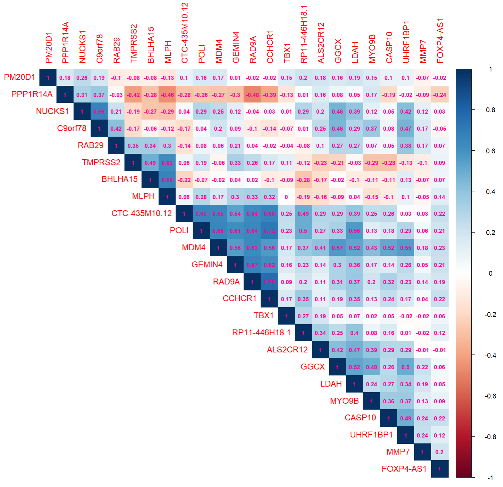
```

R package `clusterProfiler` is used for gene functional annotation:

```{r, results = 'hide', echo=TRUE, message=FALSE, warning=FALSE, eval=FALSE}
library(clusterProfiler)
library(org.Hs.eg.db)
ego <- enrichGO(gene = as.character(outGenes$entrezGeneId),
                OrgDb = org.Hs.eg.db,
                ont= "BP",
                pAdjustMethod ="none",
                readable = TRUE)
dotplot(ego, showCategory=15)
```

```{r, prostate_Go.png, fig.align = 'center', out.width = "80%", echo=FALSE}
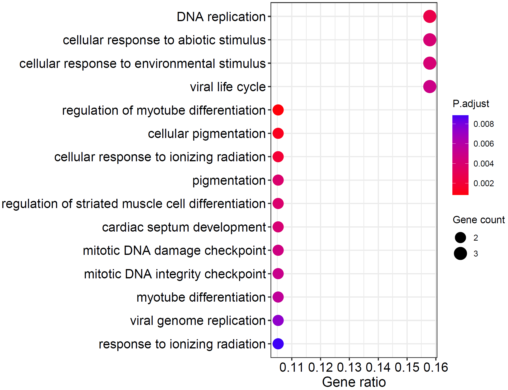
```


