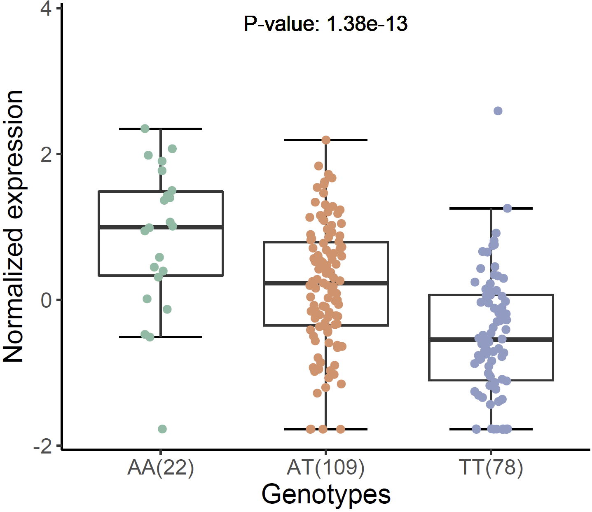
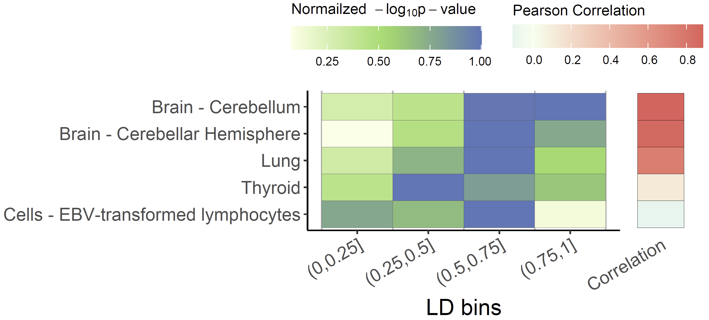

```{r, include = FALSE}
knitr::opts_chunk$set(
  echo=TRUE,
  progress =FALSE,
  comment = "#>"
)
```

A disease target gene discovery framework is provided to detect susceptible genes and causal variants, which consists of two modules, including **colocalization analysis** and **tissue propensity analysis**.

## Before we start

Colocalization analysis can be performed with `xQTLbiolinks` by providing their own GWAS summary statistics data. All we need to prepare include three parts:

1.  GWAS summary statistics dataset.
2.  Name of tissue of interest.
3.  Following three installed packages.

```{r, results = 'hide', echo=TRUE, message=FALSE, warning=FALSE, eval=FALSE}
library(data.table)
library(xQTLbiolinks)
library(stringr)
```

## Step 1. data pre-processing

```{r, message=FALSE, warning=FALSE, include=FALSE}
temp1 <- tempfile(fileext=".zip")
download.file("https://github.com/dingruofan/exampleData/raw/master/env.zip", temp1)
load(unz(temp1,"env.Rdata"))
close(file(temp1))
rm(temp1)
```

Download and load an example file of summary statistics dataset (GRCh38). We perform colocalization analysis in `Brain - Cerebellum`.

```{r, results = 'hide', echo=TRUE, message=FALSE, warning=FALSE, eval=FALSE}
gwasDF <- fread("http://raw.githubusercontent.com/dingruofan/exampleData/master/gwas/AD/gwasDFsub.txt")
tissueSiteDetail="Brain - Cerebellum"
```

In this example, a data.table object of 16538 (rows) x 5 (cols) is loaded. Five columns are required (arbitrary column names is supported, but columns must be as the following order):

`Col 1`. "variants" (character), , using an rsID (e.g. "rs11966562");

`Col 2`. "chromosome" (character), one of the chromosome from chr1-chr22;

`Col 3`. "position" (integer), genome position of snp;

`Col 4`. "P-value" (numeric);

`Col 5`. "MAF" (numeric). Allel frequency;

`Col 6`. "beta" (numeric). effect size.

`Col 7`. "se" (numeric). standard error.

```{r, eval=TRUE}
head(gwasDF)
```

Now we can perform quality control for this GWAS dataset by estimating the genomic inflation factor,  validating QQ-plot and PZ-plot using xQTLbiolinks.

```{r, results = 'hide', echo=TRUE, message=FALSE, warning=FALSE, eval=FALSE}
xQTLvisual_qqPlot(gwasDF[,.(pValue)])
```

```{r, compare.png, fig.align = 'center', out.width = "50%", echo=FALSE}

```
The x-axis of the QQ-plot represents the expected p-values under the null hypothesis, while the y-axis represents the observed p-values from the GWAS summary statistics data. 

## Step 2. Seek sentinel snps.

Sentinel SNPs can be detected using `xQTLanalyze_getSentinelSnp` with the arguments `p-value < 5e-8` and `SNP-to-SNP distance > 10e6 bp`. We recommend converting the genome version of the GWAS file to GRCh38 if that is GRCh37 (run with parameter: `genomeVersion="grch37"`; `grch37To38=TRUE`, and package `rtracklayer`is required).

```{r, results = 'hide', echo=TRUE, message=FALSE, warning=FALSE, eval=FALSE}
sentinelSnpDF <- xQTLanalyze_getSentinelSnp(gwasDF, pValueThreshold = 5e-08)
```

After filtering, a sentinel SNP with P-value\<5e-8 is detected in this example:

```{r, eval=TRUE}
sentinelSnpDF
```

## Step 3. Identify trait genes for each sentinel SNPs.

Trait genes are genes that located in the range of 1Mb (default, can be changed with parameter `detectRange`) of sentinel SNPs. Every gene within 1Mb of sentinel SNPs is searched by fuction `xQTLanalyze_getTraits`. Besides, In order to reduce the number of trait genes and thus reduce the running time, we take the overlap of eGenes and trait genes as the final output of the function `xQTLanalyze_getTraits`.

```{r, results = 'hide', echo=TRUE, message=FALSE, warning=FALSE, eval=FALSE}
traitsAll <- xQTLanalyze_getTraits(sentinelSnpDF, detectRange=1e6, tissueSiteDetail=tissueSiteDetail)
```

Totally, 3 associations between 3 traits genes and 1 SNPs are detected

```{r, eval=TRUE}
traitsAll
```

## Step 4. Conduct colocalization analysis.

**For a single trait gene**, like *CLNK* in above table, colocalization analysis (using `coloc` method) can be performed with:

```{r, results = 'hide', echo=TRUE, message=FALSE, warning=FALSE, eval=FALSE}
output <- xQTLanalyze_coloc(gwasDF, "CLNK", tissueSiteDetail=tissueSiteDetail) # using gene symbol
```

*output* is a list, including three parts: *coloc_Out_summary*, *gwasEqtlInfo*, and *gwasEqtlInfo*.

```{r, eval=TRUE}
output$coloc_Out_summary
```

**For multiple trait genes**, a for loop or lapply function can be used to get all genes' outputs (using both `coloc` and `hyprcoloc` methods).

```{r, results = 'hide', echo=TRUE, message=FALSE, warning=FALSE, eval=FALSE}
outputs <- rbindlist(lapply( unique(traitsAll$gencodeId), function(x){ # using gencode ID.
           xQTLanalyze_coloc(gwasDF, x, tissueSiteDetail=tissueSiteDetail, method = "Both")$colocOut }))
```

*outputs* is a data.table that combined all results of *coloc_Out_summary* of all genes.

```{r, eval=TRUE}
outputs
```

## Step 5. Visualization of the results.

For the potential casual gene ***ENSG00000109684.14*** (PP4=**0.9937** & hypr_posterior=**0.9793**) with candidate SNP ***rs13120565*** (SNP.PP.H4=**0.5328849** & hypr_posterior_explainedBySnp=**0.4747**), We merge the variants of GWAS and eQTL by rsid.

```{r, results = 'hide', echo=TRUE, message=FALSE, warning=FALSE, eval=FALSE}
eqtlAsso <- xQTLdownload_eqtlAllAsso(gene="ENSG00000109684.14", 
                                     tissueLabel = tissueSiteDetail)
gwasEqtldata <- merge(gwasDF, eqtlAsso[,.(rsid=snpId, position=pos, maf, pValue)],
                      by=c("rsid", "position"), suffixes = c(".gwas",".eqtl"))
```

Visualization of p-value distribution and comparison of the signals of GWAS and eQTL:

```{r, results = 'hide', echo=TRUE, message=FALSE, warning=FALSE, eval=FALSE}
xQTLvisual_locusCompare(gwasEqtldata[,.(rsid, pValue.eqtl)], 
                        gwasEqtldata[,.(rsid, pValue.gwas)], legend_position = "bottomright")
```


```{r, compare.png, fig.align = 'center', out.width = "50%", echo=FALSE}

```

Locuszoom plot of GWAS signals:

```{r, results = 'hide', echo=TRUE, message=FALSE, warning=FALSE, eval=FALSE}
xQTLvisual_locusZoom(gwasEqtldata[,.(rsid, chrom, position, pValue.gwas)], legend=FALSE)
```


```{r, gwas_legendF.png, fig.align = 'center', out.width = "50%", echo=FALSE}

```

Locuszoom plot of eQTL signals:

```{r, results = 'hide', echo=TRUE, message=FALSE, warning=FALSE, eval=FALSE}
xQTLvisual_locusZoom(gwasEqtldata[,.(rsid, chrom, position, pValue.eqtl)], 
                     highlightSnp = "rs13120565", legend=FALSE)
```

```{r, eqtl_legendF.png, fig.align = 'center', out.width = "50%", echo=FALSE}

```

Violin plot of normalized exprssion of eQTL (rs13120565-ENSG00000187323.11):

```{r, results = 'hide', echo=TRUE, message=FALSE, warning=FALSE, eval=FALSE}
xQTLvisual_eqtlExp("rs13120565", "ENSG00000109684.14", tissueSiteDetail = tissueSiteDetail)
```

```{r, exp.png, fig.align = 'center', out.width = "30%", echo=FALSE}

```

We can also combine locuscompare and locuszoom plot using `xQTLvisual_locusCombine`:

```{r, results = 'hide', echo=TRUE, message=FALSE, warning=FALSE, eval=FALSE}
xQTLvisual_locusCombine(gwasEqtldata[,c("rsid","chrom", "position", "pValue.gwas", "pValue.eqtl")], 
                        highlightSnp="rs13120565")
```


```{r, xQTLvisual_locusCombine.png, fig.align = 'center', out.width = "90%", echo=FALSE}
knitr::include_graphics("images/quick_start/xQTLvisual_locusCombine.png")
```

Colocalized loci should show a general pattern where SNPs in high LD will show strong associations with expression levels of the colocalized gene, and the eQTL associations will weaken for SNPs in lower LD. This pattern of the eQTL varies among different tissues / cell-types, the strength of which indicates the power of the regulatory effect of the variant. We can easily distinguish this patten using **Tissue Propensity Analysis**, and uncover the tissue / cell-type that the variant can play the most significant regulatory role in.


```{r, results = 'hide', echo=TRUE, message=FALSE, warning=FALSE, eval=FALSE}
propensityRes <- xQTLanalyze_propensity( gene="ENSG00000109684.14", variantName="rs13120565", 
                                         tissueLabels = c("Brain - Cerebellar Hemisphere", 
                                         "Brain - Cerebellum", "Treg memory", "Colon - Transverse", 
                                         "CD4+ T cell", "Kidney - Cortex", "Uterus", "Esophagus - Mucosa", "LCL") )
```

A p-value<0.05 that calculated via permutation test indicates there exists a significant correlation between the correlation coefficient of LD and eQTL significance.


```{r, eval=TRUE}
propensityRes$tissuePropensity
```

using a heatmap plot to visualize the result:
```{r, results = 'hide', echo=TRUE, message=FALSE, warning=FALSE, eval=FALSE}
xQTLvisual_qtlPropensity(propensityRes)
```

```{r, propensity.png, fig.align = 'center', out.width = "70%", echo=FALSE}

```

For applying `xQTLbiolinks` to a whole case study, please find this [**Document**](https://dingruofan.github.io/xQTLbiolinks/articles/Colocalization_analysis_with_xQTLbiolinks.html).


