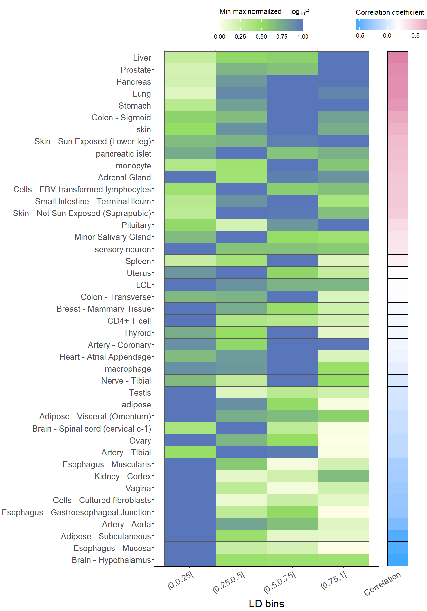
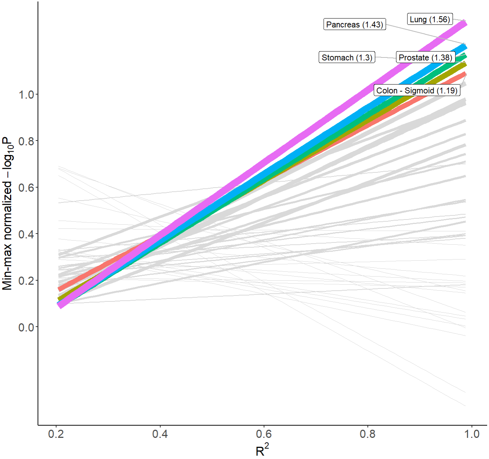

```{r, include = FALSE}
knitr::opts_chunk$set(
  echo=TRUE,
  progress =FALSE,
  comment = "#>"
)
```

```{r, results = 'hide', echo=TRUE, message=FALSE, warning=FALSE, eval=FALSE}
library(data.table)
library(xQTLbiolinks)
library(stringr)
```


In order to easily distinguish whether an eQTL is tissue/cell-type specific or shared across multiple tissue/cell groups, the function `xQTLanalyze_qtlSpecificity` is developed. For a given gene-variant eQTL pair, following five steps are executed sequentially in the function: 

1. Retrieve R2 of linkage disequilibrium between the specified variant and the variants around it.

2. Fetch the eQTL associations of the specified gene for above LD-associated variants among multiple tissue/cells in all studies (default).

3. Normalize the -log10 p-value of eQTL with min-max method for each tissue.

4. Calculate the pearson correlation coefficient between R2 and normalized p-value.

5. Fit linear models to carry out regression with the formula: normalized p-value ~ R2.

After above steps, the function generate the outputs of "correlation coefficient" and "slope" for each tissue to uncover the trend of eQTL significance across LD degree. A greater value of "correlation coefficient" or "slope" suggests a more tissue/cell-type-specific pattern of the eQTL.

Here, we take an example of eQTL of a pair of "MMP7"-"rs11568818".
```{r, results = 'hide', echo=TRUE, message=FALSE, warning=FALSE, eval=FALSE}
speDT <- xQTLanalyze_qtlSpecificity(gene="MMP7", variantName="rs11568818", study="")
```

```{r, message=FALSE, warning=FALSE, include=FALSE}
temp1 <- tempfile(fileext=".zip")
download.file("https://github.com/dingruofan/exampleData/raw/master/MMP7.zip", temp1)
load(unz(temp1,"MMP7.env"))
close(file(temp1))
rm(temp1)
```

The output contains four data.table objects, including: "snpLD" for LD details of the specified SNP; "assoAllLd" for eQTL details of LD-associated SNPs;  "lm_R2_logP" for liner regression results; "cor_R2_logP" for correlation outputs;
```{r, message=FALSE, warning=FALSE, eval=TRUE}
names(speDT)
```

To visualize the significiance across degree, the function `xQTLvisual_qtlSpecificity` is developed, and two plot methods is available: heatmap and regression.

For heatmap, All SNPs that LD-associated with the specified SNP are devided into four (default) R2 bins, (0, 0.25], (0.25, 0.5], (0.5, 0.75], and (0.75, 1] according to their LD score, then display the SNP with the smallest p-value in each bin across different tissues/cells. Note: p-value are min-max normailized after being taken the logarithm using base 10.
```{r, results = 'hide', echo=TRUE, message=FALSE, warning=FALSE, eval=FALSE}
xQTLvisual_qtlSpecificity(speDT, outPlot = "heatmap")
```

```{r, heatmap_MMP7.png, fig.align = 'center', out.width = "65%", echo=FALSE}
# 
```

For regression, Top 5 (default) tissues with the largest values of slope are displayed with different color, the other are grey, X-axis indicates R2, and y -axis indicates p-value are min-max normailized after being taken the logarithm using base 10. Numbers in brackets of labels indicate slope.
```{r, results = 'hide', echo=TRUE, message=FALSE, warning=FALSE, eval=FALSE}
xQTLvisual_qtlSpecificity(speDT, outPlot = "regression")
```

```{r, regression_MMP7.png, fig.align = 'center', out.width = "65%", echo=FALSE}
# 
```

