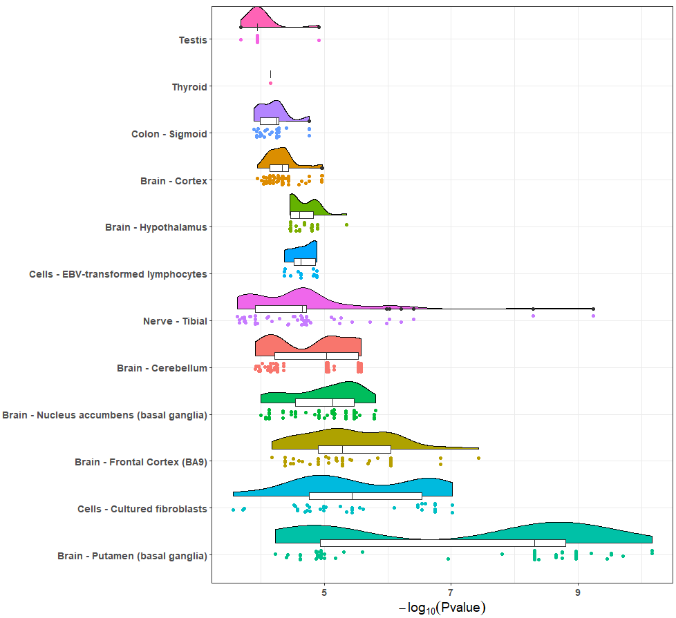
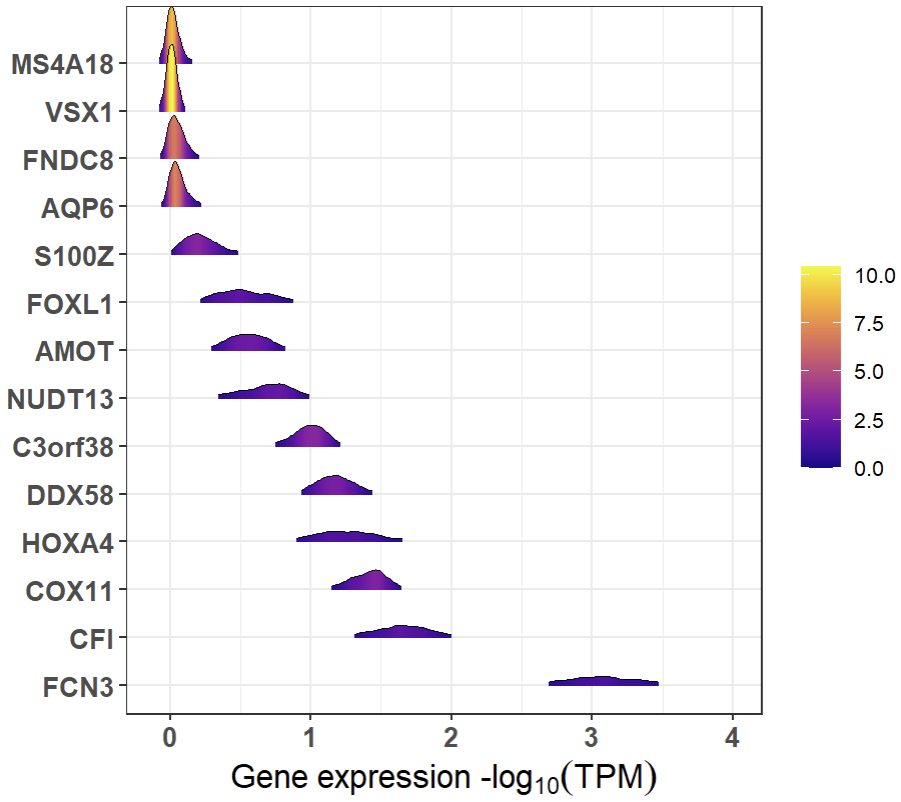
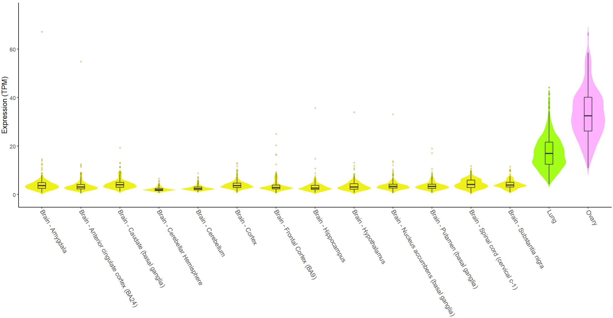
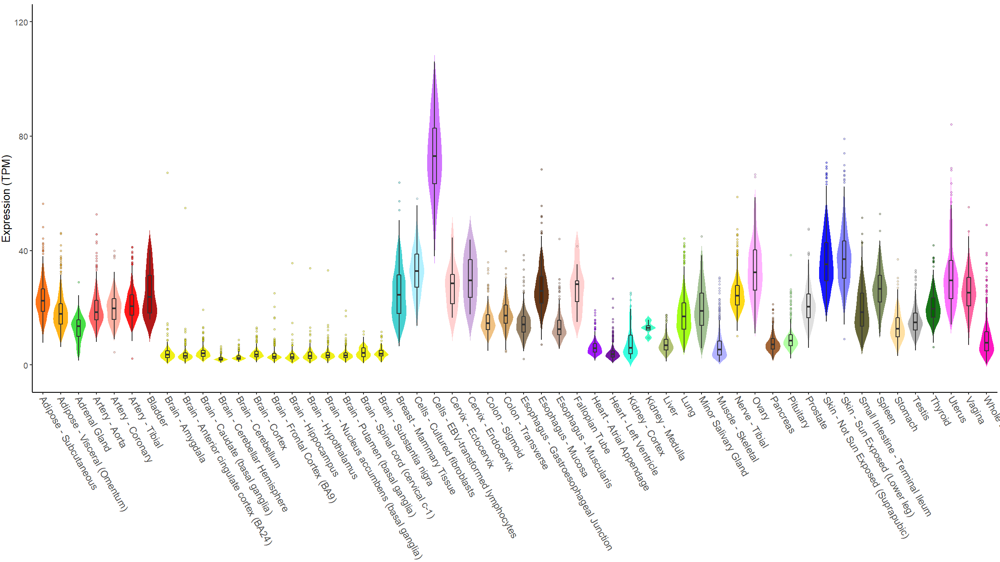
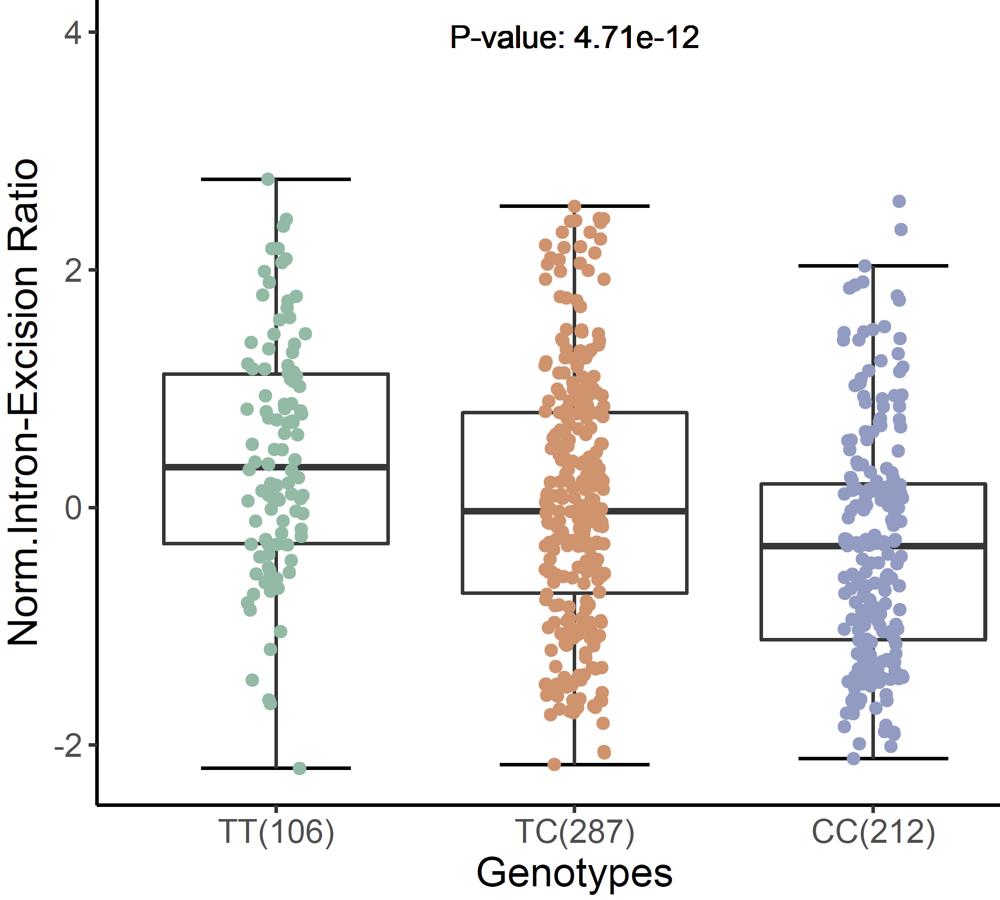
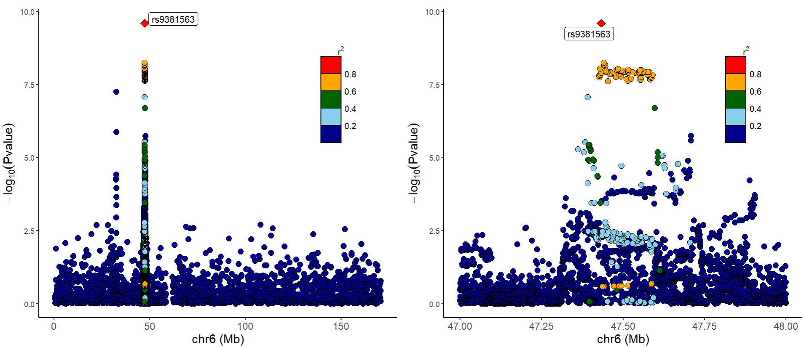
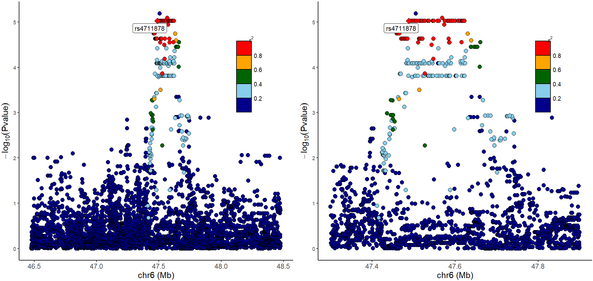
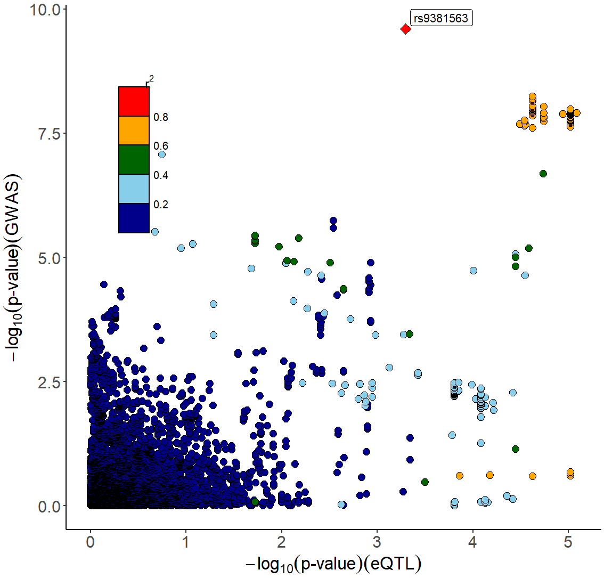
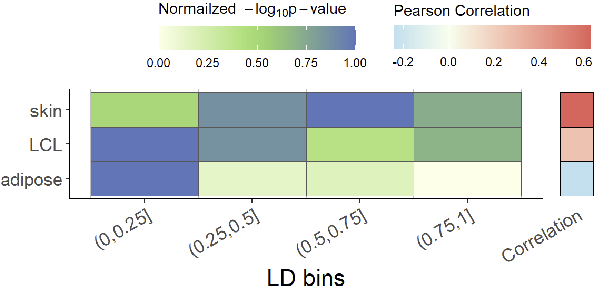

```{r, include = FALSE}
knitr::opts_chunk$set(
  echo=TRUE,
  progress =FALSE,
  comment = "#>"
)
options(rmarkdown.html_vignette.check_title = FALSE)
```

***
## **NOTE! The GTEx Portal API update has caused some functions of xQTLbioliks to malfunction. The package will be updated within one week to address this issue.**
***

Some visual examples are provided in this vignette, including example data, code, and figures.

**Visualilzation** of eQTL, sQTL, gene expression across tissues. 


```{r, results = 'hide', echo=TRUE, message=FALSE, warning=FALSE, eval=FALSE}
xQTLvisual_eqtl("KIF15")
```

```{r, xQTLvisual_eqtl.png, fig.align = 'center', out.width = "70%", fig.cap = "", echo=FALSE}

```


```{r, results = 'hide', echo=TRUE, message=FALSE, warning=FALSE, eval=FALSE}
 genes <- c("FNDC8", "S100Z", "AQP6", "AMOT", "C3orf38", "FOXL1", "COX11", "FCN3", "DDX58", "CFI", "MS4A18", "NUDT13", "HOXA4", "VSX1")
 xQTLvisual_genesExp(genes, tissueSiteDetail="Lung")
```

```{r, xQTLvisual_genesExp.png, fig.align = 'center', out.width = "70%", fig.cap = "", echo=FALSE}

```

```{r, results = 'hide', echo=TRUE, message=FALSE, warning=FALSE, eval=FALSE}
geneExpTissues <- xQTLvisual_geneExpTissues("TP53", tissues=c("Lung", "Brain","Ovary"))
```

```{r, visualization_tissueExp.png, fig.align = 'center', out.width = "70%", fig.cap = "", echo=FALSE}

```

```{r, results = 'hide', echo=TRUE, message=FALSE, warning=FALSE, eval=FALSE}
geneExpTissues <- xQTLvisual_geneExpTissues("TP53")
```

```{r, geneExpTissues.png, fig.align = 'center', out.width = "90%", fig.cap = "", echo=FALSE}

```

```{r, results = 'hide', echo=TRUE, message=FALSE, warning=FALSE, eval=FALSE}
expEqtl <- xQTLvisual_eqtlExp(variantName="rs78378222", gene ="TP53",
                              tissueSiteDetail="Lung")
expEqtl
```

```{r, xQTLvisual_eqtlExp.png, fig.align = 'center', out.width = "30%", fig.cap = "", echo=FALSE}
knitr::include_graphics("images/visualization/xQTLvisual_eqtlExp.png")
```

```{r, results = 'hide', echo=TRUE, message=FALSE, warning=FALSE, eval=FALSE}
expSqtl <- xQTLvisual_sqtlExp(variantName="chr11_66561248_T_C_b38",variantType="variantId",
                              phenotypeId ="chr11:66348070:66353455:clu_8500:ENSG00000255468.6",
                              tissueSiteDetail="Skin - Sun Exposed (Lower leg)")
expSqtl
```

```{r, xQTLvisual_sqtlExp.png, fig.align = 'center', out.width = "30%", fig.cap = "", echo=FALSE}

```


>LocusZoom plot for **GWAS** dataset:

```{r, results = 'hide', echo=TRUE, message=FALSE, warning=FALSE, eval=FALSE}
library(data.table)
gwasDF <- fread("https://gitee.com/stronghoney/exampleData/raw/master/gwasChr6Sub4.txt")
p_all <- xQTLvisual_locusZoom(gwasDF)
p_sub <- xQTLvisual_locusZoom(gwasDF, posRange="chr6:4.7e7-4.8e7", population ="EUR")
cowplot::plot_grid(p_all, p_sub, align = "h", ncol = 2)
```

```{r, visualization_locusZoom.png, fig.align = 'center', out.width = "90%", fig.cap = "", echo=FALSE}

```


>LocusZoom plot for **eQTL** signals of a gene of interest:

```{r, results = 'hide', echo=TRUE, message=FALSE, warning=FALSE, eval=FALSE}
eqtlAsso <- xQTLdownload_eqtlAllAsso("RP11-385F7.1",
                                     tissueLabel = "Brain - Cortex")
p_all <- xQTLvisual_locusZoom(eqtlAsso[,c("snpId", "chrom", "pos", "pValue")], highlightSnp="rs4711878" )
p_sub <- xQTLvisual_locusZoom(eqtlAsso[,c("snpId", "chrom", "pos", "pValue")], highlightSnp="rs4711878",
                              posRange="chr6:47.3e6-47.9e6")
cowplot::plot_grid(p_all, p_sub, align = "h", ncol = 2)
```

```{r, visualization_locusZoom_eQTL1.png, fig.align = 'center', out.width = "90%", fig.cap = "", echo=FALSE}

```


```{r, results = 'hide', echo=TRUE, message=FALSE, warning=FALSE, eval=FALSE}
library(data.table)
eqtlDF <-fread("https://gitee.com/stronghoney/exampleData/raw/master/eqtl/eqtlAsso1.txt")
gwasDF <-fread("https://gitee.com/stronghoney/exampleData/raw/master/gwas/AD/gwasChr6Sub3.txt")
xQTLvisual_locusCompare( eqtlDF, gwasDF, legend_position="topleft")
```

```{r, visualization_locusCompare.png, fig.align = 'center', out.width = "50%", fig.cap = "", echo=FALSE}

```


```{r, results = 'hide', echo=TRUE, message=FALSE, warning=FALSE, eval=FALSE}
gwasEqtldata <- data.table::fread("http://bioinfo.szbl.ac.cn/xQTL_biolinks/xqtl_data/gwas/AD/gwasEqtldata.txt")
xQTLvisual_locusCombine(gwasEqtldata, highlightSnp="rs13120565")
```

```{r, xQTLvisual_locusCombine.png, fig.align = 'center', out.width = "90%", fig.cap = "", echo=FALSE}
knitr::include_graphics("images/visualization/xQTLvisual_locusCombine.png")
```

```{r, results = 'hide', echo=TRUE, message=FALSE, warning=FALSE, eval=FALSE}
xQTLvisual_coloc( gene="MMP7", variantName="rs11568818", study="TwinsUK")
```

```{r, xQTL_visual_eQTLspecificity.png, fig.align = 'center', out.width = "70%", fig.cap = "", echo=FALSE}

```

